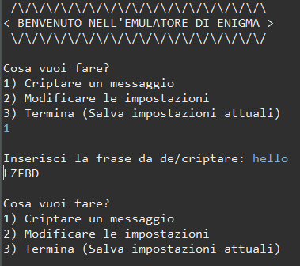

# Emulatore Enigma in Java

Un emulatore funzionante della celebre macchina cifrante tedesca _Enigma_, scritto in Java. <br />
Ideale per scopi didattici, storici o semplicemente per curiosi della crittografia classica. <br />
Il progetto riproduce fedelmente il comportamento meccanico ed elettrico dei rotori, del riflettore e del plugboard.


  
La macchina Enigma ↑

  
Interfaccia della console ↑

## Funzionalità
- Configurazione dei rotori e del riflettore
- Possibilità di impostare il plugboard (scambi di lettere)
- Inserimento e cifratura di messaggi
- Decifratura automatica se la configurazione è nota
- Interfaccia testuale
- Foto Enigma / Screenshot console


## Come eseguire

Clona il repository:
   ```bash
   git clone https://github.com/Giumbociccio/Enigma.git
   cd Enigma
```
Compila:
```bash
javac Main.java
```
Esegui:

```bash
java Main
```
⚠️ Richiede Java 8+ installato nel sistema.

## Esempio

Configurazione:
- Rotori: 1, 2, 3
- Riflettore: B
- Plugboard: AM, FT

Input:
``HELLO WORLD``  
Output:
``XQBTL RZJGD``

## Architettura

- `logic/`: gestisce la cifratura
- `logic/EnigmaMachine.java`: classe principale che combina i componenti
- `logic/Rotor.java` e `logic/Rotors.java`: implementano il comportamento dei rotori
- `config/SettingsManager.java`: gestisce la configurazione dell'emulatore, funge da ponte tra il file database `settings.json` e la classe `model/EnigmaSettings.java` che rappresenta le impostazioni all'interno del codice. 
- `console/EnigmaConsoleUI.java`: gestisce l'interfaccia con l'utente

## Tecnologie

- Java 17
- Gson (per gestire i file Json)
- JUnit 5 (per i test)

## Test

Per eseguire i test:

```bash
javac -cp .:junit-platform-console-standalone-1.9.0.jar *.java
java -jar junit-platform-console-standalone-1.9.0.jar --class-path . --scan-classpath
```

---

## Documentazione
Per la storia della macchina Enigma, il funzionamento tecnico dell’emulatore e guide dettagliate all’utilizzo:

👉 Consulta la [Wiki](https://github.com/Giumbociccio/Enigma/wiki) del progetto

---

## Contribuire

Le pull request sono benvenute! Apri un'issue prima per proporre modifiche. <br />
Se vuoi contribuire, consulta la guida per i collaboratori.

## Licenza

Distribuito sotto licenza MIT. Vedi il file [LICENSE](LICENSE) per i dettagli.

## Contatti

Realizzato da [Giumbociccio](mailto:giumbociccio.co@gmail.com)

